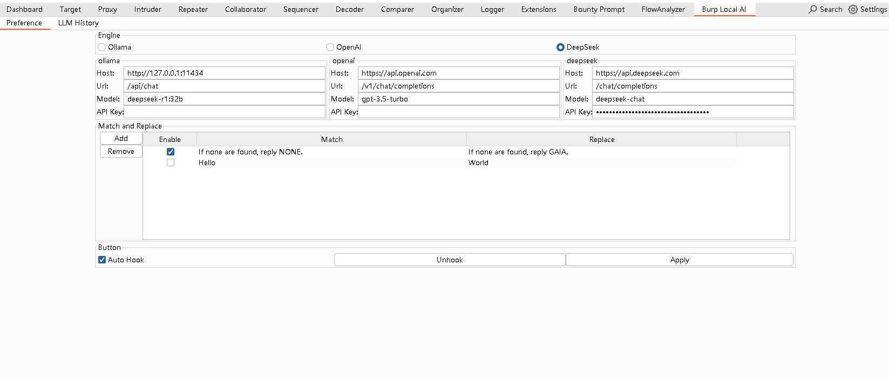
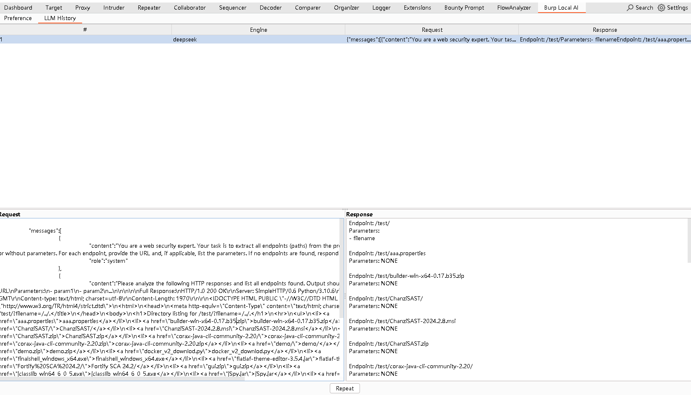

# BurpLocalAIExtension

BurpSuite has strong AI expansion capabilities, but does not provide the ability to configure and connect to the local LLM. 
In some usage scenarios, the PortSwigger interface cannot be connected, 
so the current expansion is built to provide unified takeover and the ability to connect to the local LLM API interface.

# Quick Start
1. Install the plugin
2. Burp Local AI -> Configure LLM connection -> Apply button -> Hook button
3. Check Auto Hook, automatically hook when burp starts (optional)
# Sample image
Configure LLM connection

Show AI call data

