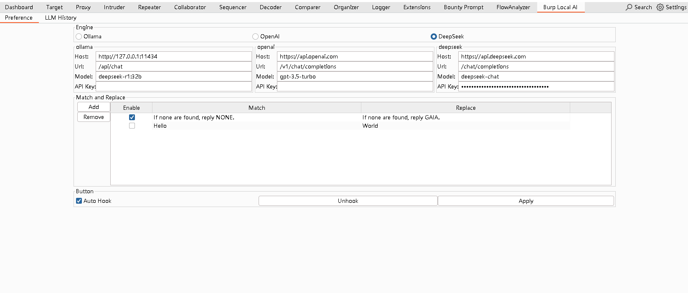
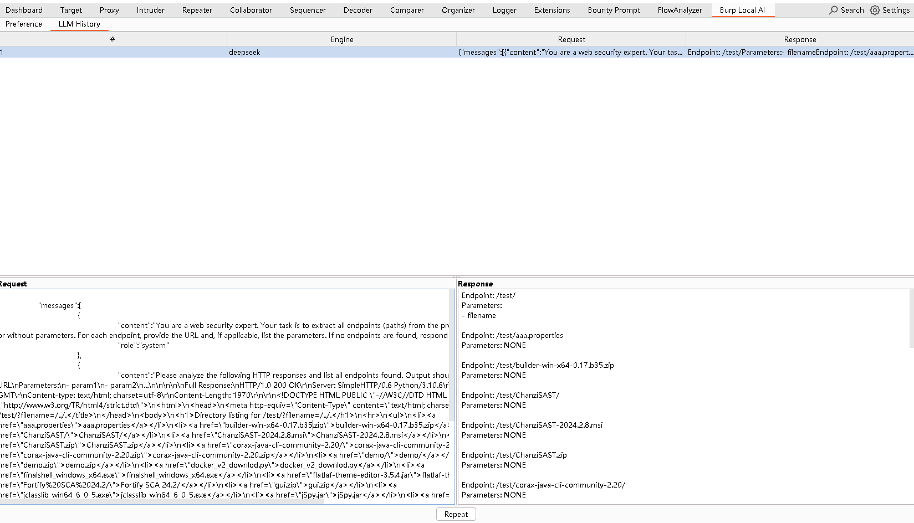

# BurpLocalAIExtension

BurpSuite的AI拓展能力很强，但是不提供配置对接本地LLM的能力。
部分使用场景下不能连接PortSwigger的接口，故构建当前拓展用于提供统一接管并对接到本地LLM API接口的能力。

# 快速开始
1. 安装插件
2. Burp Local AI -> 配置对接LLM -> Apply按钮 -> Hook按钮
3. 勾选 Auto Hook，启动时自动Hook（可选）
# 示例图片
配置对接LLM

展示调用AI的数据

